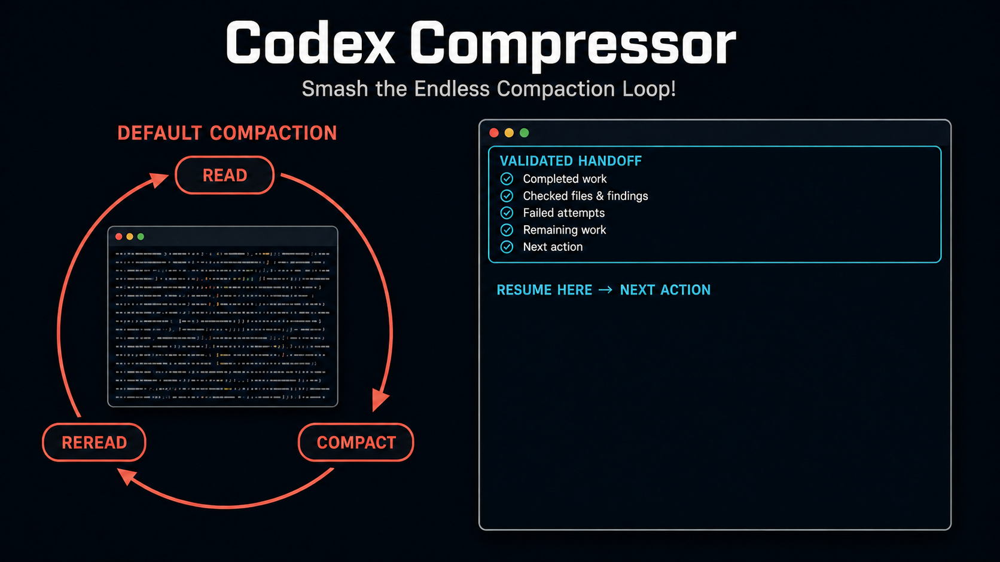

# Codex Compressor

[한국어](README_ko.md)



**Break Codex's `read → compact → reread` loop on long-running tasks.**

## Why

**Codex's built-in compaction**

> Shortened history → Omitted details → Reread files and reconstruct decisions → Compact again

**Codex Compressor**

> Validated cumulative handoff → Fresh context window → Resume from the exact next action

- Creates a visible cumulative handoff while the active agent still has the full context.
- Validates, saves, and reinjects the handoff through hooks.
- Starts the new window with context headroom and resumes from the exact next action without repeating completed work.

**Requirements:** Python 3.11 or later · Windows, macOS, or Linux · standalone installation or local Codex plugin

## Standalone installation

macOS and Linux:

```sh
./install.sh install --mode standalone
```

Windows PowerShell:

```powershell
.\install.ps1 install --mode standalone
```

## Plugin installation

Register the repository as a local marketplace and install the plugin:

```text
codex plugin marketplace add .
codex plugin add codex-compressor@codex-compressor-local
```

Complete the plugin setup:

```sh
# macOS and Linux
./install.sh install --mode plugin
```

```powershell
# Windows PowerShell
.\install.ps1 install --mode plugin
```

Open `/hooks` in Codex, approve the `codex-compressor` hooks, and start a new session.

## Commands

macOS and Linux:

```sh
./install.sh status
./install.sh doctor
./install.sh uninstall
```

Windows PowerShell:

```powershell
.\install.ps1 status
.\install.ps1 doctor
.\install.ps1 uninstall
```

## License

Licensed under the [Apache License 2.0](LICENSE). Copyright 2026 hehee9.
