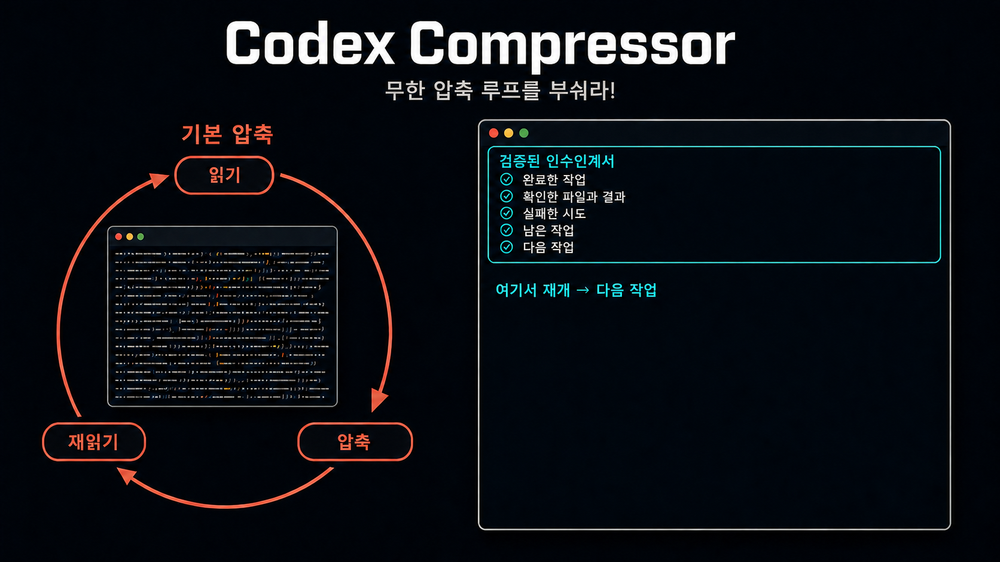

# Codex Compressor

[English](README.md)



**긴 작업에서 반복되는 Codex의 `읽기 → 압축 → 재읽기` 무한 루프를 끊습니다.**

## 필요한 이유

**Codex 기본 압축**

> 축약된 기록 → 세부 내용 누락 → 파일과 결정 재확인 → 다시 압축

→ 압축-압축 사이에 작업을 완료하지 못하면 **무한 반복 발생**

**Codex Compressor**

> 인수인계서 → 새 컨텍스트 창 → 정확한 다음 작업부터 재개

- 기존 컨텍스트가 온전히 남아 있을 때 작업 내용을 누적한 인수인계서를 작성합니다.
- 훅이 인수인계서를 검증·저장하고 새 창에 다시 주입합니다.
- 새 창에서 충분한 컨텍스트 여유를 확보하고 정확한 다음 작업부터 이어갑니다.

⭐ [GitHub에서 Codex Compressor 스타하기](https://github.com/hehee9/codex-compressor)

**요구 사항:** Python 3.11 이상 · Windows, macOS, Linux · 독립 실행형 또는 로컬 Codex 플러그인

## 독립 실행형 설치

macOS와 Linux:

```sh
git clone https://github.com/hehee9/codex-compressor.git
cd codex-compressor
./install.sh install --mode standalone
```

Windows PowerShell:

```powershell
git clone https://github.com/hehee9/codex-compressor.git
Set-Location codex-compressor
.\install.ps1 install --mode standalone
```

## 플러그인 설치

복제한 저장소를 로컬 마켓플레이스로 등록하고 플러그인을 설치합니다.

```text
codex plugin marketplace add .
codex plugin add codex-compressor@codex-compressor-local
```

플러그인 설정을 완료합니다.

```sh
# macOS와 Linux
./install.sh install --mode plugin
```

```powershell
# Windows PowerShell
.\install.ps1 install --mode plugin
```

Codex에서 `/hooks`를 열어 `codex-compressor` 훅을 승인한 뒤 새 세션을 시작합니다.

## 명령어

macOS와 Linux:

```sh
./install.sh status
./install.sh doctor
./install.sh uninstall
```

Windows PowerShell:

```powershell
.\install.ps1 status
.\install.ps1 doctor
.\install.ps1 uninstall
```

## 라이선스

[Apache License 2.0](LICENSE)에 따라 배포됩니다. Copyright 2026 hehee9.
